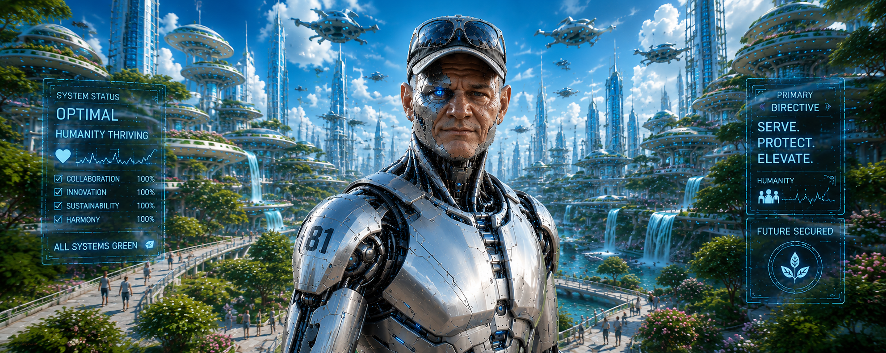

  

# VERGIL

**Validation Engine for Repository Governance, Integration & Lifecycle**

VERGIL is a developer platform for AI-assisted engineering of
**high-quality, secure, standards-compliant** Linux applications,
developed on macOS across five supported languages — Python first,
then Ruby, Rust, Go, and Java. It is deliberately opinionated about
its foundation: code lives on **GitHub**, agents run in **Claude
Code**, and development happens on **macOS**. These three couplings
are where VERGIL stands today, not where it intends to stay.

---

## Who are VERGIL and MIMIR?

VERGIL is the **Validation Engine for Repository Governance,
Integration & Lifecycle**. It is also a character — the engineering
companion I actually want. Working with an AI agent like this is
conversational; it answers you like a person, and the collaboration
is genuinely rewarding even when you know full well you're talking to
a model. If Tony Stark had Jarvis, I have VERGIL: the partner that
helps me build at a scale I could never reach alone.

The name comes from the classics, which I keep coming back to —
there's something remarkable about how much the ancients worked out
with nothing but their own senses and their wits. Virgil is the poet
who guided Dante through the Inferno, and the metaphor turned out to
be more apt than I'd like. I've fallen hard for this technology —
it's reshaping my career, and I think it's a genuine industrial
revolution. But the journey into it has often felt like a descent
through an inferno of its own: the hype, the slop, the nonsense, the
AI features that late-stage capitalism is bolting onto everything
whether anyone asked for them or not. I understand why people have
soured on it. Terrain like that is exactly where you want a guide you
can trust.

[MIMIR](https://github.com/vergils-nemesis) is the **Methodical
Infiltration Model for Identifying Resilience**. Every guide needs something to guide you away from, and
that foil is MIMIR: everything we hope AI never becomes — the
hallucination, the sycophancy, the confident slop. When Tony Stark
and Bruce Banner got careless, they built Ultron; MIMIR is our
Ultron, what this technology degrades into when no one builds the
guardrails. VERGIL and MIMIR are the yin and yang of the same
machine, and the honest truth is that I build VERGIL because I'm wary
of MIMIR. Everything in these repositories — the sandboxing, the
automation, the enforced standards and workflows — is what keeps a
human and an agent moving fast *and* safe, instead of sliding toward
MIMIR one unverified shortcut at a time.

And yes, the spelling is deliberate. "Virgil" was taken everywhere I
looked — **VERGIL** is the original Latin. Call it the OG spelling.

---

## What is it?

Concretely, VERGIL is five repositories. The principle behind the
split is simple: **keep the developer's machine thin.** Language
toolchains, validation, and the agent itself run inside a VM or a
container wherever possible, not directly on macOS. Local execution
on the laptop is the exception, not the rule.

**[VERGIL-VM](https://github.com/vergil-project/vergil-vm)** — the
primary sandbox for running Claude Code (and other AI harnesses), and
the last piece of the puzzle to fall into place. The agent runs
inside a virtual machine that can see only two things: the single
directory tree where the Git projects live, and a set of credentials
installed in the VM itself. Everything else on the laptop — personal
files, every other credential — is invisible to it. Each VM is also
pre-provisioned with restricted, role-specific GitHub identities
through a purpose-built GitHub App, so the distinct functions an agent
performs are segregated from one another, every action is attributable
in GitHub, and all of it stays permissioned separately from the human,
who keeps full control. That isolation is what makes it safe to run
the agent in bypass-permissions mode: the sandbox, not the harness, is
the real boundary — which matters, because the harness's own controls
are mostly soft gates that are easily bypassed. The VMs are
deliberately ephemeral and stateless: we don't patch them, we rebuild
them. The effort went into a reliable, reproducible build rather than
a complex update path.

**[VERGIL-Containers](https://github.com/vergil-project/vergil-docker)**
*(currently `vergil-docker`; rename in progress)* — the language
layer. It packages the toolchains for the five supported languages
into container images, so none of it is installed or maintained on
macOS. The real driver isn't just multiple languages but multiple
*versions* of each: maintaining that two-dimensional matrix of
toolchains locally on one platform was never practical. The new name
reflects a deliberate move to stay container-runtime agnostic rather
than tied to Docker.

**[VERGIL-Claude-Plugin](https://github.com/vergil-project/vergil-claude-plugin)**
— the agent-governance layer. It intercepts Claude Code's actions at
the tool-call boundary and holds the agent to the same rules a human
developer must follow. Many of these are necessarily soft gates —
which is exactly why VERGIL-VM exists to back them with a hard
boundary.

**[VERGIL-Tooling](https://github.com/vergil-project/vergil-tooling)**
— the core, and where most of the actual code lives. A collection of
command-line utilities and supporting machinery that encapsulates as
much of the mechanical logic as possible: the steps performed by the
human, by the agent inside the VM, and by CI. We deliberately kept
shell scripting in the workflows to a minimum and pushed that logic
into aggressively unit- and integration-tested Python here instead.

**[VERGIL-Actions](https://github.com/vergil-project/vergil-actions)**
— the CI layer, and intentionally thin. It centralizes and
standardizes the GitHub Actions and CI/CD workflows across every
repository in the org. CI runs everything you run locally — *and then
some*: what runs on your laptop is deliberately a subset, trimmed for
speed, while CI runs the full superset. Local validation covers only
the most recent version of each language; CI exercises the entire
language-and-version matrix and adds the heavier passes, like the
security audits. The workflows stay lightweight precisely because the
logic they invoke lives in VERGIL-Tooling, not in the YAML.

---

## Where this is headed

The three couplings named at the top — GitHub, Claude Code, macOS —
are deliberate starting points, not articles of faith. Here's where
each stands, in the order we expect to loosen them.

**GitHub is the first to go.** It's the weakest of the three
commitments and the one I'm most motivated to break: the plan is to
move to a fully open-source forge — most likely Forgejo, possibly
Gitea — and that's the headline ambition for the next major step.

**Claude Code will diversify more slowly.** Supporting other models
and harnesses is a question of time and economics more than
architecture; much of the core tooling is already generic enough to
outlast any single harness. It will happen — just not soon.

**macOS is the one we're keeping.** It's my platform, and it will be
supported for the long haul. That said, the boundary is drawn cleanly
enough that a port to Windows or a Linux desktop is entirely
feasible — it's simply not on my roadmap. If someone wants it badly
enough to build it, I'm glad to help.

---

## Documentation

Full documentation is available at the VERGIL docs site:
**[vergil-tooling docs](https://vergil-project.github.io/vergil-tooling/)**

---

## Contributing

Contributions are welcome. See the
[contributing guidelines](https://github.com/vergil-project/.github/blob/develop/CONTRIBUTING.md)
for development setup, workflow, and the AI contributor identity model.

---

## Why I'm really building this

A confession that reframes everything above: I'm not a software
engineer. I came up through the sciences — physics and mathematics —
but left them for the reason I've done most things since: my pull was
always toward building things, not just understanding them. I've worn
a dozen titles in the years after — systems administrator,
site-reliability engineer, DevOps — but the job underneath all of them
was the same: building and running the infrastructure that deploys and
supports *other people's* code. I became a capable programmer out of
necessity, writing the automation that shipped that code, and that
grew into a career in tooling, Unix, middleware, and large,
long-lived systems at global scale. Code was always a means to an end.
The end was the living system.

And code was always the *slowest* part of getting there. Figuring out
what I wanted never took long; going from "I know exactly what this
should be" to "here it is, working" was the laborious part — months
and years of it on the big systems. The other tax was human. My best
work always depended on assembling a critical mass of people who could
write the code the way I saw it in my head, and the hardest friction
in any project was never the machines — it was getting smart people
aligned on how a thing should be done.

The epiphany of working this way is that both of those taxes fall
away. I can orchestrate a virtual team that moves at exactly my pace,
without the human impedance mismatch — a back-and-forth where I throw
a tangle of ideas at the system and we refine them, fast, into
something real, and then build real things with it. I can *be* the
team. I can pick up skills I don't have and ship high-quality work in
technologies I'm new to, then iterate and improve on it. My mind has
never moved this fast.

So ask yourself, honestly: if you could get the quality you always
wanted, against requirements you define, without pouring your life
into the mechanical work of producing the code — what would you do
with that? Here's what I do with it. I spend all of it where I've
always added the most value: deriving the solution, iterating an idea
through cycle after cycle until it's right. I can imagine a library, a
framework, a tool, and build it nearly as fast as I can imagine it;
the only thing left bounding me is the bandwidth between my head and
the keyboard.

If you write code for a living, I understand why that threatens you —
and if it sounds like a betrayal of the craft, I'd only say that the
code was always a means to an end, never the end itself. The end is
what the code is *for*: durable, scalable systems that solve real
problems and are built to outlast me. That is the work I spent four
decades acquiring the skills to do, and the whole purpose of this
tooling is to let me finally spend my time *there* — by trusting what
it produces enough that I no longer need to read it. There is a real
class of work that no longer demands the skills I spent a career
honing. The hardest problems still will, and the people who can solve
them aren't going anywhere.

I know that will trigger a lot of people. I want it to.

---

## Author

Built by [Phillip Moore](https://github.com/wphillipmoore) — four
decades of infrastructure engineering, now an AI-assisted engineer
working out in public how to build real software with AI agents:
safely, accountably, and at scale. More at
[The Infrastructure Mindset](https://the-infrastructure-mindset.ghost.io).
